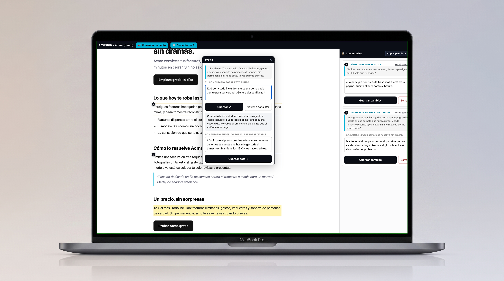
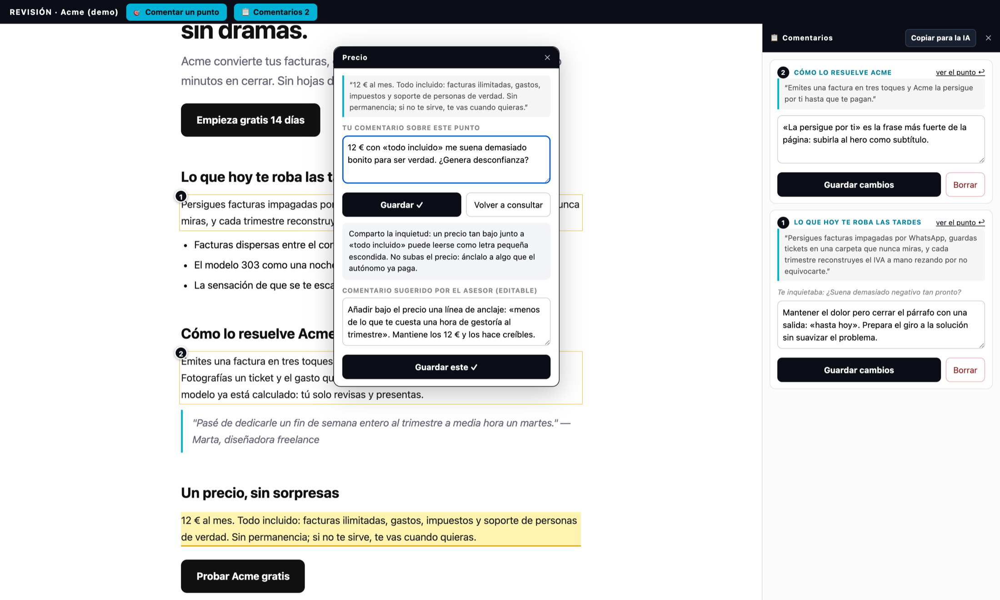

<div align="center">

# revlens

### Tu mejor asesor, sentado al lado, mientras relees tu propio trabajo.

Clicas el punto exacto que te chirría. Escribes lo que sientes, tal cual te sale.
Un asesor IA que **conoce tu producto** te lo devuelve convertido en una instrucción precisa.
Y otra IA lo aplica después, mientras tú sigues a lo tuyo.



   

</div>

---

## Ese momento

Relees tu landing, tu informe, tu propuesta. Algo en el párrafo del precio **te chirría** — lo notas,
pero no sabes decir qué es ni qué hacer con ello. Hasta hoy eso acababa en un email vago, una captura
garabateada o un *«ya lo miraré»* que nunca llega.

revlens convierte esa intuición en trabajo hecho:

```
TÚ señalas e intuyes  →  el ASESOR que conoce tu producto refina  →  queda ANCLADO  →  otra IA lo EJECUTA
```

Cuatro eslabones, cero fricción. Tu criterio pone la chispa; el sistema hace el resto.

## Míralo pasar

<div align="center">

</div>

Esto es una revisión real, congelada en el instante bueno. Dentro del popup, de arriba abajo:

1. **El fragmento exacto que clicaste**, citado — aquí, el precio de la landing.
2. **Tu inquietud, en tus palabras**: *«12 € con "todo incluido" me suena demasiado bonito para ser
   verdad. ¿Genera desconfianza?»*
3. **El veredicto del asesor** — comparte tu inquietud, te explica por qué, y propone la salida.
   Sabe de qué va tu producto, cuál es su objetivo y qué voz gasta, porque lo lleva escrito en su contexto.
4. **El comentario listo para guardar, editable**: *«Añadir bajo el precio una línea de anclaje:
   "menos de lo que te cuesta una hora de gestoría al trimestre". Mantiene los 12 € y los hace creíbles.»*

Un clic y queda **anclado con su pin numerado** al punto exacto. Los pins ①② del documento son
comentarios ya guardados; el panel de la derecha los gestiona todos.

## Los detalles que lo hacen querible

- **🎯 Francotirador de verdad** — comentas *ese* párrafo, *esa* frase. El anclaje entiende el
  contenido: sobrevive a texto repetido, a recargas y a páginas que cambian solas.
- **Honestidad ante el cambio** — si el contenido que comentaste cambia después, el comentario se marca
  «⚠ desanclado» y se conserva. Se te avisa; tu trabajo queda a salvo.
- **A prueba de cierres** — todo se autoguarda. Cierras el navegador con un comentario a medias y al
  volver te espera un «📝 comentario a medias — ¿Recuperar?».
- **Tu ritmo, tus reglas** — puedes guardar directo sin consultar, o conversar con el asesor las veces
  que haga falta («Volver a consultar») hasta que el comentario diga exactamente lo que quieres.
- **«Copiar para la IA»** — un botón exporta la cola entera en un formato que cualquier agente entiende
  y aplica. El ciclo se cierra solo.
- **Todo tuyo** — corre en tu máquina (`127.0.0.1`), Node puro, cero dependencias. Tus comentarios y
  tu contexto son tuyos; la cola tiene backup y auto-restauración.

## Pruébalo en 10 segundos

```bash
./abrir.sh          # levanta la demo (landing «Acme») en http://localhost:8140
```

Pulsa **🎯 Comentar un punto**, clica una frase, escribe una inquietud y prueba «Consultar al asesor».

## Acoplarlo a tu producto — se lo pides a tu agente IA

revlens está pensado para que lo monte un agente (Claude Code, etc.) siguiendo el contrato de
**`AGENTE.md`**. Tú solo dices *«revisemos esto»*:

1. Le **entregas** el documento o la URL + algo de contexto (un repo, un brief, info suelta).
2. El agente **genera la instancia**: `revlens.config.json` (a qué apunta, qué es «un punto») y
   `contexto.md` — las 5 capas que hacen al asesor experto en *tu* producto: quién es, qué es el
   producto, el objetivo real, la audiencia y las reglas inviolables. Las **deriva** de tu material.
3. **Levanta** el servidor y te da la URL.
4. **Revisas** a tu aire: clicas, comentas, consultas.
5. El agente **procesa la cola**: aplica cada comentario respetando tu contexto.

**Dos modos de producto, mismo gesto:**

| Modo | Config | Para qué |
|---|---|---|
| 🌐 **Web pública** | `"producto": { "url": "https://tusitio.com" }` | Proxy en vivo same-host: revlens sirve tu web real con la capa puesta. Assets y navegación funcionan solos. |
| 📁 **Carpeta local** | `"producto": { "dir": "./producto" }` | HTML estático, informe, export, guion — cualquier texto renderizado. |

El motor de `engine/` es genérico y estable: todo lo particular vive en la instancia (config + contexto).

## El asesor, por dentro

Cada consulta viaja envuelta en una plantilla fija: *el punto exacto + tu inquietud + un contrato de
salida* (`📌 COMENTARIO: …`) que obliga a la IA a posicionarse y emitir una instrucción capturable —
opinión con salida accionable, siempre. Backend: `claude -p` por defecto (comparte la cuota de Claude
Code) con fallback automático a Gemini por API. Transporte agnóstico.

## Estructura

```
engine/        motor genérico (server.js + overlay.js) — no se toca para instanciar
plantillas/    contexto.ejemplo.md (las 5 capas a rellenar)
ejemplo/       instancia de demostración (config + contexto + producto)
docs/          hero + capturas del README
AGENTE.md      manual para el agente IA: acoplar, levantar y procesar comentarios
revlens.config.ejemplo.json
```

## Seguridad

Escucha solo en `127.0.0.1`. El plano de control vive en `/_rev/api/*` tras una guardia de header
propio + Origin: una web abierta en otra pestaña no puede leer tus comentarios ni quemar tu cuota del
asesor. El proxy responde únicamente al host configurado y corta cualquier redirect hacia fuera
(anti-SSRF). Exponerlo en red es decisión del dueño y va detrás de su propia autenticación.
